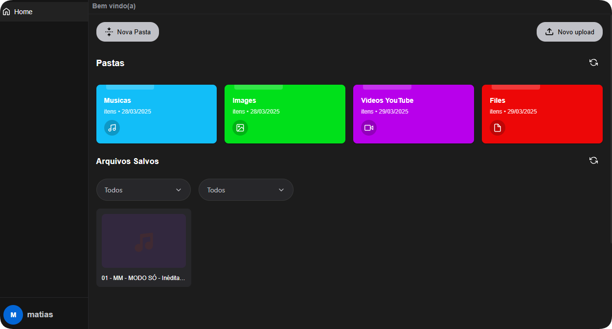

# File Upload Application

<div align="center">
  
</div>

A cross-platform desktop application for file uploads built with Electron, React, TypeScript, and AWS S3 integration.

## Features

- Drag and drop file uploads
- Progress tracking
- File management (rename, delete, organize)
- Secure authentication
- AWS S3 storage integration
- Cross-platform support (Windows, macOS, Linux)

## Technologies

### Frontend

- Electron
- React
- TypeScript
- SCSS for styling
- React Router for navigation

### Backend

- Node.js
- TypeScript
- Express.js
- AWS SDK for S3 integration

## Prerequisites

- Node.js (v16+)
- Yarn package manager
- AWS account with S3 bucket configured

## Installation

Clone the repository and install dependencies:

```bash
# Clone the repository
git clone https://github.com/glopmts/glop-uploads.git

# Navigate to project directory
cd file-upload-app

# Install dependencies
yarn install
```
